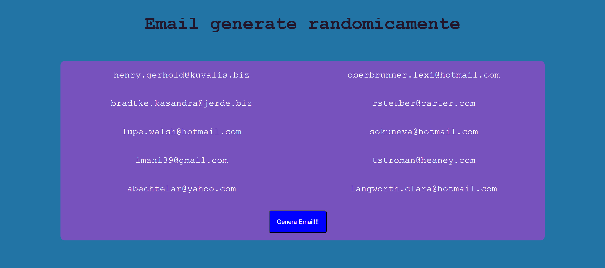

<h1 align="center">Email List</h1>

###

  
  
  
  
  
  
  

###

Descrizione  Attraverso l'apposita API di Boolean https://flynn.boolean.careers/exercises/api/random/mail generare 10 indirizzi email e stamparli in pagina all'interno di una lista.  Bonus  Abbellire con CSS o Bootstrap Inserire un bottone che al click faccia il fetch altre 10 mail (sostituendo le altre)

###

